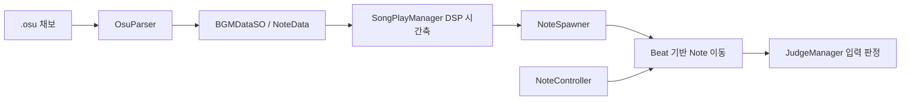

# Beat & Buddy — Code Samples

오디오 클럭을 기준으로 노트 생성·이동·판정을 같은 시간축에 맞추고, `.osu` 채보를 게임 데이터로 변환한 리듬게임 코드입니다.

## 프로젝트 정보

| 항목 | 내용 |
|---|---|
| 개발 형태 | 팀 프로젝트 |
| 담당 역할 | Unity 클라이언트 개발 |
| 주요 담당 | DSP 기반 리듬 코어, `.osu` 채보 파서, 활성 노트 조회 계층 |
| 개발 환경 | Unity, C#, Unity Audio, DOTween |
| 대상 플랫폼 | Windows |

## 핵심 문제

- 프레임 시간에 의존할 경우 음악과 노트 위치·판정이 누적해서 어긋나는 문제
- 곡마다 노트 시각을 수동 입력하면 데이터 제작 비용과 오류가 커지는 문제
- 보스 패턴이 기존 리듬 규칙과 별개로 동작하면 플레이 경험이 분리되는 문제

## 구조 요약

## 폴더

| 폴더 | 내용 |
|---|---|
| [RhythmCore](./RhythmCore/README.md) | DSP 시간축, Beat 기반 노트 생성·이동·판정 |
| [BeatmapImport](./BeatmapImport/README.md) | `.osu` 파일 파싱과 ScriptableObject 데이터 연결 |
| [BossPattern](./BossPattern/README.md) | 활성 노트를 조건별로 조회해 보스 패턴에서 재사용 |

## 권장 읽기 순서

1. [`SongPlayManager.cs`](./RhythmCore/SongPlayManager.cs)
2. [`OSUParser.cs`](./BeatmapImport/OSUParser.cs)
3. [`NoteSpawner.cs`](./RhythmCore/NoteSpawner.cs)
4. [`Note.cs`](./RhythmCore/Note.cs)
5. [`JudgeManager.cs`](./RhythmCore/JudgeManager.cs)
6. [`NoteController.cs`](./BossPattern/NoteController.cs)

## 주요 의존성

- Unity Audio / `AudioSettings.dspTime`
- DOTween
- 프로젝트 공용 PoolManager 및 SceneSingleton

## 공개 범위

UI, 사운드 매니저, 플레이어 연출과 공용 풀 구현은 제외했습니다. 각 파일은 실제 프로젝트에서 핵심 시간 계산과 판정 흐름을 확인하기 위한 샘플입니다.
