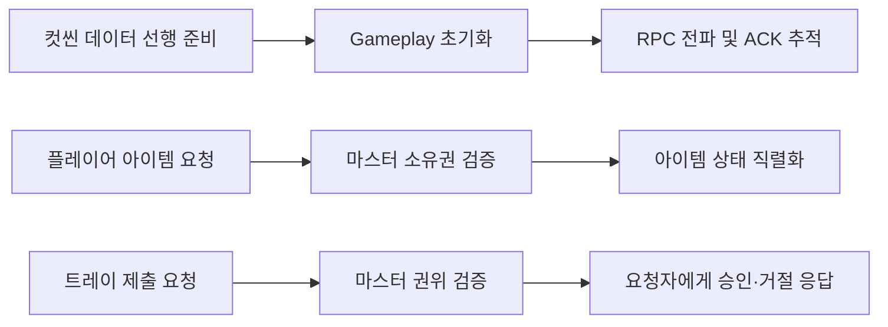

# Don’t Dilly-Dally! — Code Samples

Photon PUN2 기반 멀티플레이 협동 게임에서 담당한 **스테이지 초기화, 네트워크 아이템 동기화, 트레이 제출 권한 처리** 코드를 선별했습니다.

## 프로젝트 정보

| 항목 | 내용 |
|---|---|
| 개발 형태 | 팀 프로젝트 |
| 플레이 형태 | 4인 협동 멀티플레이 |
| 담당 역할 | PM 및 Unity 클라이언트 개발 |
| 주요 담당 | 스테이지 흐름, 아이템 네트워크 동기화, 트레이 제출 권한 처리 |
| 개발 환경 | Unity, C#, Photon PUN2, UniTask, UniRx |
| 대상 플랫폼 | Windows |

## 핵심 문제

- 클라이언트마다 씬·데이터 준비 완료 시점이 달라 초기화 순서가 어긋나는 문제
- 두 플레이어가 같은 아이템을 동시에 잡을 때 소유권과 보유 상태가 충돌하는 문제
- 컨테이너 보관·풀 재사용 이후 아이템 위치가 원점 또는 이전 위치로 잘못 보간되는 문제
- 클라이언트가 제출한 데이터를 그대로 신뢰할 경우 판정 상태가 불일치할 수 있는 문제

## 구조 요약

## 폴더

| 폴더 | 내용 |
|---|---|
| [StageFlow](./StageFlow/README.md) | 컷씬 선행 데이터 준비, Gameplay 초기화, RPC ACK 추적 |
| [NetworkItems](./NetworkItems/README.md) | 소유권 요청 중재, 논리 상태 직렬화, 네트워크 오브젝트 회수 |
| [TraySubmission](./TraySubmission/README.md) | 마스터 권위 기반 트레이 제출 요청·검증·응답 |

## 권장 읽기 순서

1. [`StagePreloader.cs`](./StageFlow/StagePreloader.cs)
2. [`StageFlowBootstrapper.cs`](./StageFlow/StageFlowBootstrapper.cs)
3. [`StageRpcAckCoordinator.cs`](./StageFlow/StageRpcAckCoordinator.cs)
4. [`NetworkItemOwnership.cs`](./NetworkItems/NetworkItemOwnership.cs)
5. [`HoldableItemNetworkSync.cs`](./NetworkItems/HoldableItemNetworkSync.cs)
6. [`ItemRecycleUtility.cs`](./NetworkItems/ItemRecycleUtility.cs)
7. [`TraySubmissionHandler.cs`](./TraySubmission/TraySubmissionHandler.cs)
8. [`StageFlowRpcHandler.cs`](./TraySubmission/StageFlowRpcHandler.cs)의 트레이 제출·ACK 관련 메서드

## 공개 범위

실제 프로젝트의 씬, 프리팹, 공통 데이터 타입과 다른 담당자의 코드는 제외했습니다. 따라서 이 폴더의 코드는 단독 실행보다 **권한 모델과 동기화 설계 검토**를 목적으로 합니다.
