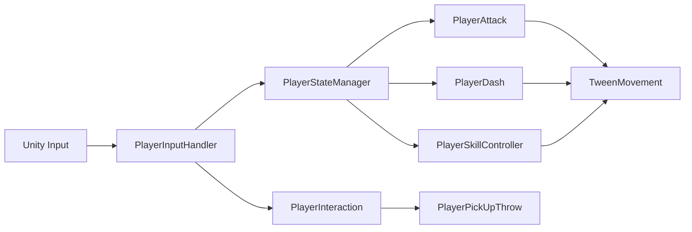

# Flora333 — Code Samples

3D 액션 게임에서 플레이어 기능이 늘어나며 입력·상태·이동 책임이 복잡해지는 문제를 해결하기 위해 구성한 컴포넌트 기반 플레이어 시스템입니다.

## 프로젝트 정보

| 항목 | 내용 |
|---|---|
| 개발 형태 | 팀 프로젝트 |
| 담당 역할 | Unity 클라이언트 개발 |
| 주요 담당 | 플레이어 상태·입력 구조, 상호작용·운반, 레벨 확장형 스킬 시스템 |
| 개발 환경 | Unity, C#, CharacterController, DOTween |
| 대상 플랫폼 | Windows |

## 핵심 문제

- 이동 컴포넌트에 일반 이동, 공격 이동, 대시, 스킬 이동이 함께 쌓이는 문제
- 각 기능이 직접 입력을 읽어 동일 입력의 의미가 상태마다 충돌하는 문제
- 상호작용 대상이 늘어날 때 플레이어가 구체 클래스에 의존하는 문제
- 스킬 레벨 확장 시 공격 방식과 판정 코드가 한 클래스에 집중되는 문제

## 구조 요약

## 폴더

| 폴더 | 내용 |
|---|---|
| [PlayerArchitecture](./PlayerArchitecture/README.md) | FSM, 입력 이벤트, 공격·대시 공통 이동 |
| [Interaction](./Interaction/README.md) | 인터페이스 기반 상호작용과 복수 오브젝트 운반 |
| [SkillSystem](./SkillSystem/README.md) | 레벨별 근접·투사체 스킬 확장 |

## 권장 읽기 순서

1. [`PlayerStateManager.cs`](./PlayerArchitecture/PlayerStateManager.cs)
2. [`PlayerInputHandler.cs`](./PlayerArchitecture/PlayerInputHandler.cs)
3. [`TweenMovement.cs`](./PlayerArchitecture/TweenMovement.cs)
4. [`PlayerAttack.cs`](./PlayerArchitecture/PlayerAttack.cs)
5. [`PlayerInteraction.cs`](./Interaction/PlayerInteraction.cs)
6. [`PlayerPickUpThrow.cs`](./Interaction/PlayerPickUpThrow.cs)
7. [`PlayerSkillController.cs`](./SkillSystem/PlayerSkillController.cs)
8. [`PlayerSkillRange.cs`](./SkillSystem/PlayerSkillRange.cs)

## 주요 의존성

- Unity CharacterController / Physics
- DOTween
- 프로젝트 공용 PoolManager·DamageUtility

## 표현 범위

열거형과 전환 규칙을 사용하는 **FSM 기반 구조**이며, 각 상태를 별도 객체로 구현한 State 패턴과는 구분됩니다.
