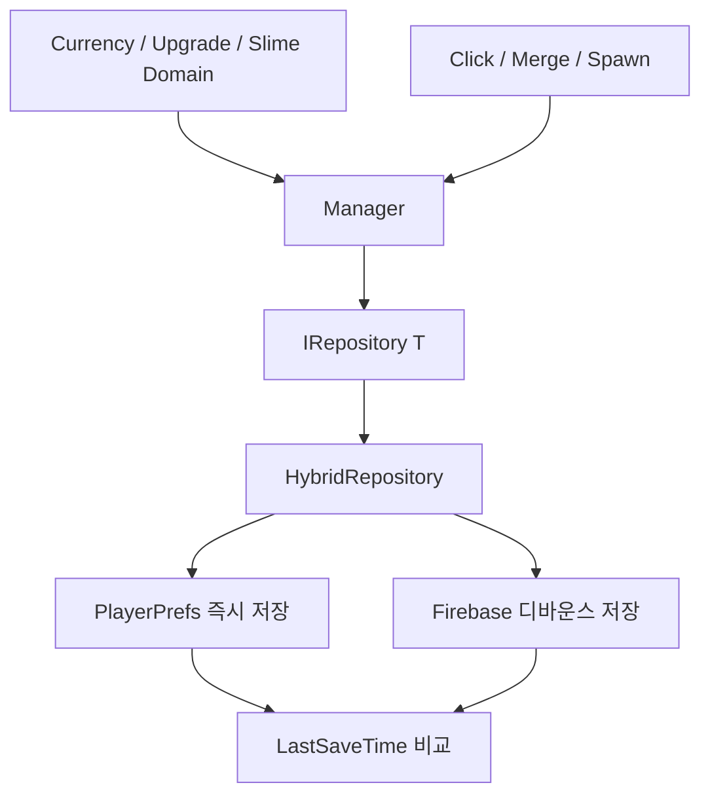

# Monster Kindergarten — Code Samples

1인 개발 클리커 게임에서 저장 방식과 게임 규칙을 분리하고, 빈번한 데이터 변경을 로컬과 Firebase에 안정적으로 반영하기 위해 구성한 코드입니다.

## 프로젝트 정보

| 항목 | 내용 |
|---|---|
| 개발 형태 | 1인 개발 |
| 개발 시기 | 2026.02 |
| 담당 범위 | 기획, Unity 클라이언트 개발, 데이터·저장 구조 설계 |
| 개발 환경 | Unity 6, C#, UniTask, Firebase Auth·Firestore |
| 대상 플랫폼 | Windows, WebGL |

## 핵심 문제

- 클릭·자동 획득·머지로 저장 요청이 매우 자주 발생하는 문제
- 로컬 데이터와 서버 데이터의 저장 시점이 달라 충돌할 수 있는 문제
- 플랫폼별 Firebase 사용 가능 여부가 다른 문제
- 재화·업그레이드·슬라임 상태 규칙이 UI와 저장 코드에 흩어지는 문제

## 구조 요약

## 폴더

| 폴더 | 내용 |
|---|---|
| [SaveArchitecture](./SaveArchitecture/README.md) | Repository 추상화, 로컬 즉시 저장, Firebase 디바운스, 최신 데이터 선택 |
| [DomainArchitecture](./DomainArchitecture/README.md) | 재화·업그레이드·슬라임 상태의 핵심 규칙과 Manager 협력 |
| [GameplayLoop](./GameplayLoop/README.md) | 클릭·드래그·머지·스폰·업그레이드 효과 연결 |

## 권장 읽기 순서

1. [`IRepository.cs`](./SaveArchitecture/IRepository.cs)
2. [`HybridRepository.cs`](./SaveArchitecture/HybridRepository.cs)
3. [`Currency.cs`](./DomainArchitecture/Currency.cs)
4. [`Upgrade.cs`](./DomainArchitecture/Upgrade.cs)
5. [`UpgradeManager.cs`](./DomainArchitecture/UpgradeManager.cs)
6. [`SlimeStatus.cs`](./DomainArchitecture/SlimeStatus.cs)
7. [`Clicker.cs`](./GameplayLoop/Clicker.cs)
8. [`MergeManager.cs`](./GameplayLoop/MergeManager.cs)

## 주요 의존성

- Unity 6
- UniTask
- Firebase Auth / Firestore
- PlayerPrefs / JsonUtility
- DOTween 및 프로젝트 공용 풀 시스템

## 플랫폼 정책

- 에디터·일반 빌드: PlayerPrefs와 Firebase를 결합한 Hybrid Repository
- WebGL: Firebase 의존 코드를 제외하고 PlayerPrefs Repository 사용
- Manager와 Domain 코드는 저장 구현 교체의 영향을 받지 않도록 구성
